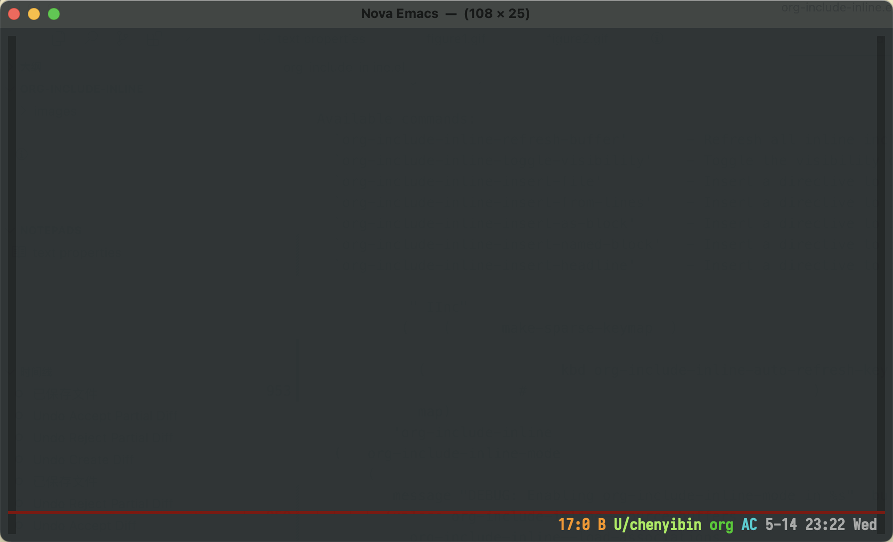
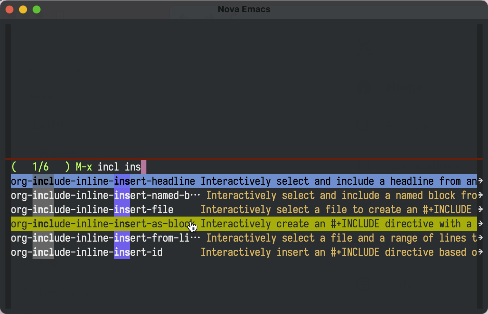

# org-include-inline

A minor mode for Org mode that displays #+INCLUDE directive contents inline within your Org buffers.

## Overview

org-include-inline enhances the Org mode editing experience by showing included content directly beneath #+INCLUDE directives, without modifying the actual buffer content. This provides immediate visual feedback while maintaining the original document structure.


## Features

- **Live Preview**: See included content directly in your buffer
- **Multiple Include Types**:
  - Include entire files
  - Include specific line ranges
  - Include as source code blocks with syntax highlighting
  - Include as example blocks or other block types
  - Include specific headlines/subtrees using title, CUSTOM_ID, or ID
- **Interactive Creation**: Easy-to-use commands for creating include directives
- **Auto-refresh**: 
  - Content updates automatically when source files change
  - Intelligent dependency tracking ensures all dependent org buffers are refreshed
  - Efficient cleanup on buffer/mode deactivation

## Installation

You can install org-include-inline through your preferred package manager. For example, with `use-package`:

```elisp
(use-package org-include-inline
  :hook (org-mode . org-include-inline-mode))
```

## Usage

### Basic Usage

1. Enable/disable the mode in any Org buffer:
```elisp
M-x org-include-inline-mode
```

2. Create include directives using any of these commands:
- `M-x org-include-inline-insert-file` - Include an entire file
- `M-x org-include-inline-insert-from-lines` - Include specific lines from a file
- `M-x org-include-inline-insert-as-block` - Include file as a block (src, example, etc.)
- `M-x org-include-inline-insert-named-block` - Include a named block from an Org file
- `M-x org-include-inline-insert-headline` - Include a headline/subtree from an Org file
- `M-x org-include-inline-insert-id` - Include an entry with ID from an Org file

When using `org-include-inline-insert-named-block`, you can:
1. Select an Org file containing named blocks
2. Choose from a list of available named blocks (showing block type and language)
3. The block will be included with its original type and properties

When using `org-include-inline-insert-headline`, you can:
1. Select an Org file containing headlines
2. Choose from a list of available headlines (showing level and CUSTOM_ID if available)
3. The headline will be included with all its content



When using `org-include-inline-insert-id`, you can:
1. Select an Org file containing entries with IDs
2. Choose from a list of available entries (showing their headlines and IDs)
3. The entry will be included with all its content



3. Auto-refresh after modified the source file:
- `C-c '` go to the source file. When used on:
  - Regular includes: Opens the source file
  - ID includes: Opens the source file and jumps to the entry with that ID
- Modify the source file.
- Save the source file
- The included content will be updated automatically.


### Include Directive Examples

```org
# Include an entire file
#+INCLUDE: "path/to/file.org"

# Include specific lines
#+INCLUDE: "path/to/file.org" :lines "5-10"

# Include as a source code block
#+INCLUDE: "path/to/script.el" src emacs-lisp

# Include as an example block
#+INCLUDE: "path/to/config" example

# Include specific lines as source code
#+INCLUDE: "path/to/script.py" src python :lines "10-20"

# Include with custom block type (must be quoted if starts with ':')
#+INCLUDE: "path/to/file" ":custom-type"

# Include a named block from an Org file
#+INCLUDE: "path/to/file.org::block-name"

# Include a specific headline/subtree (with all its content)
#+INCLUDE: "path/to/file.org::*Target_Headline"

# Include a subtree using its CUSTOM_ID
#+INCLUDE: "path/to/file.org::#custom-id-value"

# Include a subtree using its ID
#+INCLUDE: "path/to/file.org::B5623BAE-013E-42C3-9956-3D367716B3CC"
```

## Auto-refresh

There are several ways to refresh the included content:

1. **Automatic Refresh**:
   - Content updates automatically when source files are saved
   - Refreshes when buffer is reverted or window configuration changes
   - Intelligent dependency tracking ensures all dependent org buffers are refreshed

2. **Manual Refresh**:
   - Use `C-c C-x C-v` (default key binding) to refresh manually
   - Click with mouse-1 (left click) on the included content
   - Call `M-x org-include-inline-refresh` or `M-x org-include-inline-refresh-buffer`

3. **Customization**:
   ```elisp
   ;; Customize the refresh key binding
   (setq org-include-inline-auto-refresh-key "C-c C-x C-v")
   ```

## Commands

- `org-include-inline-refresh-buffer` - Refresh all inline includes in the current buffer
- `org-include-inline-insert-file` - Insert a directive to include an entire file
- `org-include-inline-insert-from-lines` - Insert a directive to include specific lines
- `org-include-inline-insert-as-block` - Insert a directive to include a file as a block
- `org-include-inline-insert-named-block` - Insert a directive to include a named block from an Org file
- `org-include-inline-insert-headline` - Insert a directive to include a headline/subtree from an Org file
- `org-include-inline-insert-id` - Insert a directive to include an entry with ID from an Org file

## Customization

```elisp
;; Auto-enable in all Org buffers
(setq org-include-inline-auto-enable-in-org-mode t)

;; Customize maximum lines to display
(setq org-include-inline-max-lines-to-display 1000)

;; Customize the display face
(set-face-attribute 'org-include-inline-face nil
                    :background "black"
                    :foreground "white")

;; Control export behavior
(setq org-include-inline-export-behavior 'selective) ;; 'selective, 'ignore, or 'process

;; Control folding behavior
(setq org-include-inline-respect-folding t)  ;; nil to always show includes
```

### Export Behavior

The mode provides flexible control over how includes are handled during export:

1. **Global Export Behavior**:
   ```elisp
   ;; Choose one of:
   (setq org-include-inline-export-behavior 'selective) ;; default
   (setq org-include-inline-export-behavior 'ignore)    ;; ignore all includes
   (setq org-include-inline-export-behavior 'process)   ;; process all includes
   ```

2. **Per-Include Control** (when `org-include-inline-export-behavior` is `'selective`):
   ```org
   #+INCLUDE: "file.org"              ;; Will be exported (default)
   #+INCLUDE: "notes.org" :export: no ;; Will not be exported
   ```

3. **Export Modes**:
   - `selective` (default): Process includes normally, except those marked with `:export: no`
   - `ignore`: Completely ignore all includes during export
   - `process`: Process all includes normally (same as org default)

### Folding Behavior

The mode can respect Org's outline folding:

1. **Global Folding Control**:
   ```elisp
   ;; Choose one:
   (setq org-include-inline-respect-folding t)   ;; default, hide with parent heading
   (setq org-include-inline-respect-folding nil) ;; always show includes
   ```

2. **Behavior**:
   - When `t`: Includes are hidden when their parent heading is folded
   - When `nil`: Includes remain visible regardless of heading state
   - Includes before any heading are always visible

## Comparison with org-transclusion

While both org-include-inline and org-transclusion deal with including content from other files, they serve different purposes:

- **Purpose**:
  - org-include-inline: Focuses on visualizing Org's native #+INCLUDE directives inline
  - org-transclusion: Provides a more general transclusion system for various content types

- **Implementation**:
  - org-include-inline: Uses overlays to display content beneath #+INCLUDE lines
  - org-transclusion: Creates actual text content in the buffer that can be edited

- **Use Cases**:
  - org-include-inline: Best for:
    - Working with existing #+INCLUDE directives
    - Quick preview of included content
    - Source code inclusion and documentation
  - org-transclusion: Better for:
    - Complex transclusion needs
    - Live editing of transcluded content
    - Advanced linking between documents

- **Simplicity**:
  - org-include-inline: Lightweight, focused on one specific feature
  - org-transclusion: More feature-rich but with higher complexity

Choose org-include-inline if you mainly work with #+INCLUDE directives and want a simple, visual way to see included content. Choose org-transclusion for more advanced document transclusion needs.

## Contributing

Contributions are welcome! Feel free to:
- Report issues
- Suggest enhancements
- Submit pull requests

## License

This project is licensed under the GNU General Public License v3.0.

## Author

Yibie (gunshotbox@gmail.com)


   ```