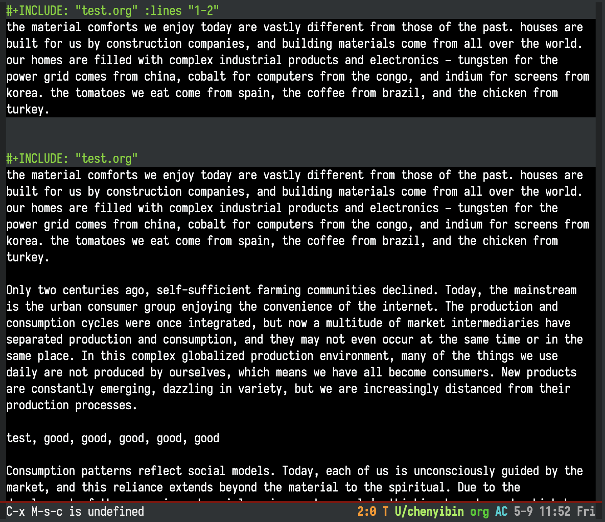

# org-include-inline

A minor mode for Org mode that displays #+INCLUDE directive contents inline within your Org buffers.

## Overview

org-include-inline enhances the Org mode editing experience by showing included content directly beneath #+INCLUDE directives, without modifying the actual buffer content. This provides immediate visual feedback while maintaining the original document structure.


## Features

- **Live Preview**: See included content directly in your buffer
- **Multiple Include Types**:
  - Include entire files
  - Include specific line ranges
- **Interactive Creation**: Easy-to-use commands for creating include directives
- **Toggle Visibility**: Show/hide included content with a single command
- **Auto-refresh**: Content updates automatically when source files change

## Installation

You can install org-include-inline through your preferred package manager. For example, with `use-package`:

```elisp
(use-package org-include-inline
  :hook (org-mode . org-include-inline-mode))
```

## Usage

### Basic Usage

1. Enable the mode in any Org buffer:
```elisp
M-x org-include-inline-mode
```

2. Create include directives using any of these commands:
- `M-x org-include-inline-insert-file` - Include an entire file
- `M-x org-include-inline-insert-from-lines` - Include specific lines from a file

3. Refresh after modified the source file:



### Include Directive Examples

```org
# Include an entire file
#+INCLUDE: "path/to/file.org"

# Include specific lines
#+INCLUDE: "path/to/file.org" :lines "5-10"
```

## Commands

- `org-include-inline-refresh-buffer` - Refresh all inline includes in the current buffer
- `org-include-inline-toggle-visibility` - Toggle visibility of all inline content
- `org-include-inline-insert-file` - Insert a directive to include an entire file
- `org-include-inline-insert-from-lines` - Insert a directive to include specific lines

## Customization

```elisp
;; Auto-enable in all Org buffers
(setq org-include-inline-auto-enable-in-org-mode t)

;; Customize maximum lines to display
(setq org-include-inline-max-lines-to-display 1000)

;; Customize the display face
(set-face-attribute 'org-include-inline-face nil
                    :background "black"
                    :foreground "white")
```

## Contributing

Contributions are welcome! Feel free to:
- Report issues
- Suggest enhancements
- Submit pull requests

## License

This project is licensed under the GNU General Public License v3.0.

## Author

Yibie (gunshotbox@gmail.com)